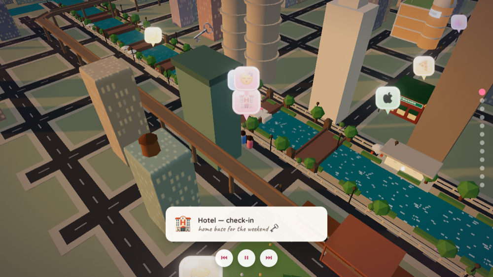

# A Weekend in Chicago 🎡

An interactive, hand-built low-poly Chicago you can travel through — right in the browser. Open a wax-sealed envelope, read the invitation, and set off on a two-day trip narrated across a stylized 3D downtown.

No map APIs, no game engine, no art assets — every building, vehicle, sound, and effect is generated in code with **Vite + vanilla JavaScript + Three.js**.

### ▶ [**Live demo →**](https://joshuatreepaik.github.io/chicago-trip-demo/)

_Best on a desktop browser with sound on. Takes ~3 minutes to play through, or click any bubble to jump around._



---

## What's inside

The trip plays on its own — a tiny couple travels the itinerary while the camera follows, the sky shifts from golden hour to night to a new morning, and the city reacts around them.

- 💌 **Envelope → letter → map** — a CSS wax-seal opening animation, then a hand-drawn letter with a **"No" button that runs away from your cursor** (with corner-escape logic so it can never be clicked).
- 🏙️ **A hand-built downtown** — instanced pastel buildings whose windows glow at night, hero landmarks (the Hancock/360 tower, Marina City, the Wrigley & Tribune buildings, the Apple Michigan Ave pavilion, and a curved-glass Starbucks Reserve Roastery), the turquoise Chicago River with **bascule drawbridges that open for the tour boat**, a landscaped Riverwalk, and **Navy Pier with a turning Ferris wheel** out over Lake Michigan.
- 🚶 **A couple that actually travels** — they **walk** the streets, **ride an architecture tour boat** out onto the lake, **ride the Ferris wheel** up and around, take an **Uber** across town, go **up to the observation deck** of the tower, and duck **inside the hotel to sleep** before coming back out the next morning.
- 🌅 **A full day → night → sunrise cycle** — keyframed sky, sun/moon, emissive windows and street-lamps, all tied to progress through the trip — capped by a **fireworks-and-confetti** celebration and a **sunset finale over the lake**.
- 🎧 **Everything is synthesized** — the music and every sound effect (footsteps, boat, car, chimes, fireworks) are generated live with the **Web Audio API**. There are no audio files.
- ✨ **Post-processing** — bloom + ACES filmic tone mapping give the night skyline its glow.

## Under the hood

A few things I had fun building:

| Piece | How it works |
|---|---|
| **Route following** | Each leg is a `CatmullRomCurve3` through hand-authored street waypoints; the couple moves at constant arc-length speed and turns to face the tangent. |
| **Articulated L-train** | Each car samples the track curve at its own arc-length offset, so the train hugs the rails through corners instead of swinging wide. |
| **Ferris-wheel ride** | An empty anchor parented to the rotating wheel; the couple's world position is copied from it each frame, so they genuinely ride up and around. |
| **Opening drawbridges** | The bridge decks are hinged halves that raise on an eased angle whenever the tour boat approaches within range. |
| **Camera rig** | A smoothed follow camera with per-stop framing that automatically lifts when a building would block the view. |
| **Signage & logos** | Building signs, the Apple logo, and the tour-boat card are drawn to `<canvas>` and used as textures — no image files. |
| **Content system** | All copy lives in one module with build-time variants, so the experience can be re-skinned without touching the engine. |

## Run it locally

```bash
npm install
npm run dev        # http://localhost:5173
```

Handy shortcut: append `#map` to the URL to jump straight to the 3D scene.

```bash
npm run build      # static output in dist/
```

`vite.config.js` uses `base: './'`, so the build works from any sub-path (e.g. GitHub Pages).

## Tech

Vite · vanilla JS (ES modules) · Three.js — `InstancedMesh`, post-processing (`UnrealBloomPass`), `CatmullRomCurve3` path-following, canvas-texture signage · Web Audio API (synthesized music + SFX) · zero runtime dependencies beyond Three.

---

Built by [Josh](https://github.com/joshuatreepaik).
